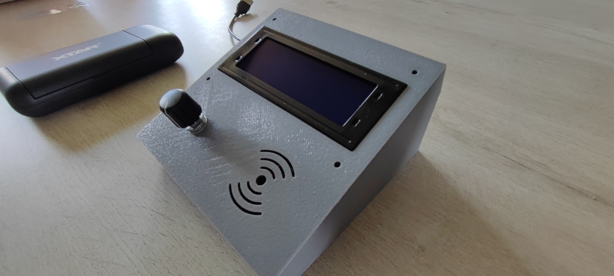
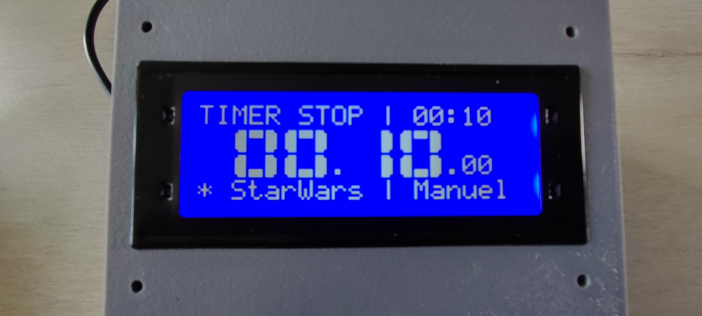
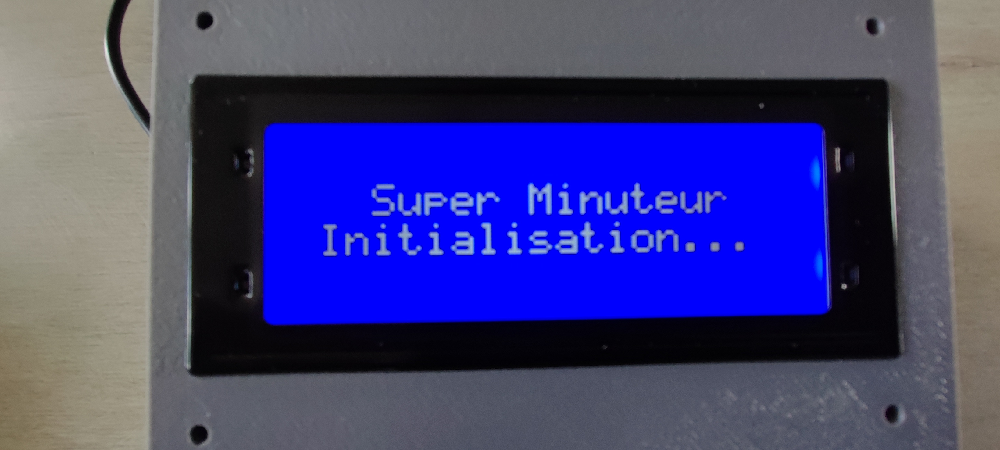
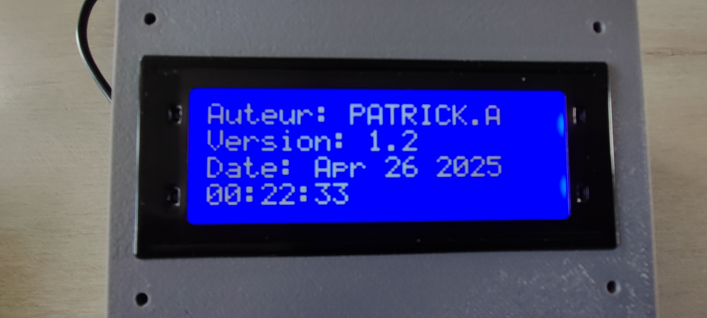
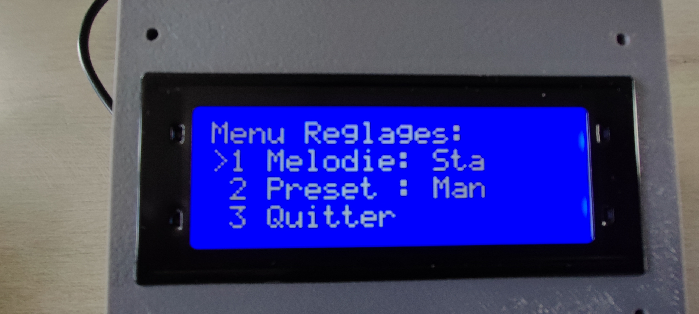

# Super Minuteur Arduino Avancé v1.4.1

Ce projet est une minuterie/compte à rebours avancé basé sur Arduino (testé sur Nano, compatible avec d'autres AVR), utilisant un encodeur rotatif avec bouton poussoir pour l'interaction, un écran LCD I2C 20x4 pour l'affichage, et incluant des fonctionnalités étendues comme l'affichage en grands chiffres, les temps préréglés, la sélection de mélodies de fin, la sauvegarde des préférences en EEPROM et une gestion de l'énergie par mise en veille. ## Fonctionnalités Principales.

* **Compte à Rebours Polyvalent :**
    * Réglage manuel du temps par paliers de 10 secondes (configurable dans `conf.h`) via l'encodeur rotatif.
    * Limite de temps manuel configurable (`MAX_TOTAL_SECONDS` dans `conf.h`).
    * Sélection de temps préréglés (ex: 1min, 2min, 3min + mode Manuel) via un menu de configuration.
    * Sauvegarde en EEPROM du dernier mode utilisé (Manuel ou Preset) et de la dernière valeur manuelle réglée.
* **Affichage Amélioré :**
    * Écran LCD I2C 20x4.
    * Affichage du temps MM:SS en grands chiffres sur 2 lignes grâce à la bibliothèque `BigNumbers_I2C` (fournie).
    * Affichage des centièmes de seconde (.CS) en taille normale pendant le décompte.
    * Ligne de statut indiquant "TIMER START" ou "TIMER STOP | MM:SS" (où MM:SS est le temps cible chargé).
    * Ligne d'information indiquant la mélodie sélectionnée et le mode Preset/Manuel actif (ex: `* Star Wars | P2`).
    * Écran de démarrage (Boot Screen) en deux étapes avec titre, puis infos auteur/version/date.
* **Alertes de Fin Configurables :**
    * Joue une mélodie sélectionnable à la fin du décompte (Mario, Star Wars, Zelda, **Nokia, Tetris** implémentés dans `melodie.h`). * Choix de la mélodie via le menu de configuration, sauvegardé en EEPROM.
    * Clignotement non-bloquant du rétroéclairage pendant 5 secondes après la mélodie. * Option pour que le clignotement ne se produise qu'une fois par cycle de timer (`blinkDone`).
* **Contrôles et Sorties :**
    * Interface utilisateur simple via encodeur rotatif (régler temps / naviguer menu) et bouton poussoir (Start/Stop / Sélection Menu / Entrer Menu via appui long).
    * Sortie Relais (configurable dans `conf.h`) activée (LOW) pendant le décompte.
    * Sortie Buzzer (configurable dans `conf.h`) pour les mélodies.
* **Gestion de l'Énergie :**
    * Mode veille automatique après une période d'inactivité configurable (uniquement lorsque le minuteur est arrêté).
    * Délai avant mise en veille réglable via le menu (ex: Off, 1min, 5min, 10min).
    * Réveil instantané par appui sur le bouton de l'encodeur.
    * Réglage de veille sauvegardé en EEPROM.
* **Configuration Facile :**
    * Fichier `conf.h` pour centraliser la configuration des broches, de l'écran LCD, des limites de temps, des valeurs de presets, des adresses EEPROM, **des options de veille**, etc. * Fichier `melodie.h` pour les définitions des notes et l'ajout/modification facile des mélodies (code dans `melodie.cpp` implicitement compilé par l'IDE).

## Matériel Requis

* Carte Arduino (Nano, Uno, ou compatible AVR avec suffisamment de mémoire)
* Encodeur Rotatif avec Bouton Poussoir (KY-040 ou similaire)
* Écran LCD I2C 20x04 (avec adaptateur PCF8574 ou similaire)
* Buzzer Actif ou Passif (selon votre choix, le code utilise `tone()`)
* Module Relais 5V (ou une LED avec résistance pour test)
* Câblage Dupont / Breadboard
* Alimentation appropriée pour l'Arduino

## Bibliothèques Requises

* `<EEPROM.h>` (Intégrée à l'IDE Arduino)
* `<Wire.h>` (Intégrée à l'IDE Arduino)
* `<string.h>` (Intégrée, utilisée pour `strlen` dans les menus)
* **LiquidCrystal_I2C :** À installer via le gestionnaire de bibliothèques de l'IDE Arduino (cherchez "LiquidCrystal I2C", plusieurs versions existent, celle de Frank de Brabander ou John Rickman sont courantes).
* **RotaryEncoder :** À installer via le gestionnaire de bibliothèques (cherchez "RotaryEncoder" par Matthias Hertel).
* **BigNumbers_I2C :** Les fichiers `BigNumbers_I2C.h` et `BigNumbers_I2C.cpp` sont inclus dans ce dépôt car potentiellement moins courants ou modifiés. Placez-les dans le dossier de votre sketch ou dans votre dossier `libraries` Arduino.
* *(Note : Les fonctions de veille utilisent `<avr/sleep.h>`, `<avr/power.h>`, `<avr/interrupt.h>` qui font partie de la toolchain AVR-GCC standard et ne nécessitent pas d'installation séparée).* ## Installation et Configuration

1.  **Connectez le matériel** en suivant les définitions de broches dans le fichier `conf.h` (`BUTTON_PIN`, `RELAY_PIN`, `BUZZER_PIN`, `ENCODER_DT_PIN`, `ENCODER_CLK_PIN`) ainsi que les broches I2C (SDA, SCL) de votre Arduino à l'écran LCD.
2.  **Installez les bibliothèques** `LiquidCrystal_I2C` et `RotaryEncoder` via le gestionnaire de bibliothèques de l'IDE Arduino si elles ne sont pas déjà présentes.
3.  **Placez les fichiers** `BigNumbers_I2C.h` et `BigNumbers_I2C.cpp` dans le dossier de votre sketch ou dans le dossier `libraries` de votre installation Arduino.
4.  **Placez les fichiers** `conf.h`, `melodie.h`, `melodie.cpp`, et le fichier `.ino` principal dans le même dossier de sketch. 5.  **Ouvrez le fichier `.ino`** avec l'IDE Arduino.
6.  **(Important)** Modifiez le fichier `conf.h` pour :
    * Définir votre nom dans `AUTHOR_NAME`.
    * Définir un numéro de version dans `FIRMWARE_VERSION` (ex: 1.4 ou 1.5 après ces ajouts). * Vérifier et ajuster si nécessaire les numéros de broches (`BUTTON_PIN`, etc.).
    * Vérifier l'adresse I2C de votre écran (`LCD_ADDR`).
    * Ajuster `MAX_TOTAL_SECONDS`, `SECOND_INCREMENT`, `PRESET_VALUES`, `NUM_MELODIES`, `SLEEP_DELAY_VALUES`, `NUM_SLEEP_OPTIONS` si désiré. 7.  **Compilez et téléversez** le code sur votre Arduino.

## Utilisation

* **Démarrage :** L'appareil affiche deux écrans de démarrage, puis l'interface principale du timer en mode arrêté, chargé avec le dernier preset utilisé ou le dernier temps manuel sauvegardé. La ligne du bas indique la mélodie active et le mode (Manuel/Px).
* **Réglage Manuel :** Lorsque le timer est arrêté, tournez l'encodeur pour régler le temps par pas de 10 secondes. L'affichage MM:SS cible apparaît sur la ligne 0, et le statut en bas passe à "Manuel".
* **Démarrage Timer :** Appuyez brièvement sur le bouton lorsque du temps est affiché (manuel ou preset). Le timer démarre, "TIMER START" s'affiche, le relais s'active (LOW), l'affichage MM:SS en grands chiffres décompte avec les centièmes.
* **Arrêt Manuel :** Appuyez brièvement sur le bouton pendant le décompte. Le timer s'arrête, le relais se désactive (HIGH), l'affichage revient à 00:00.00, mais le *temps cible* (manuel ou preset) qui tournait est rechargé et affiché sur la ligne 0 pour un redémarrage rapide.
* **Fin du Timer :** Lorsque le temps atteint zéro, la mélodie sélectionnée est jouée, puis le rétroéclairage clignote pendant 5 secondes. L'affichage est réinitialisé à 00:00.00, le relais est désactivé, et le *temps cible* (manuel ou preset) qui vient de se terminer est rechargé pour un redémarrage rapide.
* **Mise en Veille Automatique :** Si un délai de veille est configuré (différent de "Off") et que le minuteur est arrêté, l'appareil entrera en mode veille (écran éteint) après le délai d'inactivité défini. Un appui sur le bouton réveille l'appareil. * **Menu Réglages :** Lorsque le timer est arrêté, faites un **appui long** sur le bouton pour entrer dans le menu.
* **Navigation Menu :** Tournez l'encodeur pour sélectionner "Melodie", "Preset", **"Veille"**, ou "Quitter". * **Sélection Menu :** Appuyez brièvement sur le bouton pour :
    * Entrer dans le sous-menu correspondant ("Melodie", "Preset", **"Veille"**). * Quitter le menu ("Quitter").
* **Sous-Menus :** Tournez l'encodeur pour choisir l'option (Mélodie, Preset, **Délai de Veille**), appuyez brièvement pour valider. * Valider une mélodie la sauvegarde en EEPROM et revient au menu principal.
    * Valider un preset le sauvegarde en EEPROM, charge le temps correspondant, et revient directement au mode timer.
    * **Valider un délai de veille le sauvegarde en EEPROM et revient au menu principal.** ## Fichiers du Projet

* `*.ino` : Code principal Arduino gérant la logique, les états, l'affichage et les interactions.
* `conf.h` : Fichier de configuration pour les broches, constantes de temps, disposition LCD, adresses EEPROM, etc.
* `melodie.h` / `melodie.cpp`: Définit les fréquences des notes et contient les fonctions pour jouer les différentes mélodies. * `BigNumbers_I2C.h` / `BigNumbers_I2C.cpp` : Bibliothèque pour l'affichage des grands chiffres (fournie).

## Ecran Boot Screen 1:
 
## Ecran Boot Screen 2:
 
## Ecran Menu Reglages:
 

## Auteur

* [ANCHER.P - à définir dans conf.h]

## Licence

* ( GNU General Public License V3 (GPLv3) )
